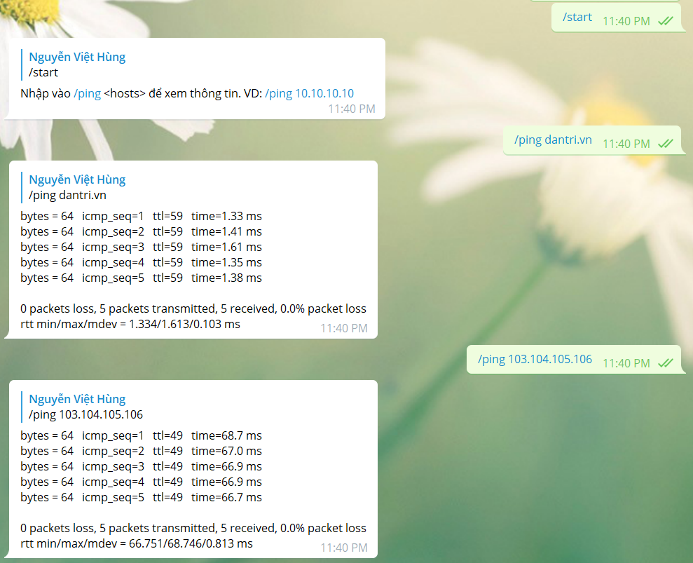

# Check Ping 

Tool sử dụng để check ping tới các máy để kiểm tra ping tới địa chỉ máy chủ chỉ định từ 1 vị trí nào đó được cài đặt sẵn. 

## 1. Cài đặt các gói cần thiết 

```
apt-get update -y
apt install -y git curl
apt install python3
apt install python3-pip -y
```

## 2. Tải về tool và cài đặt môi trường 

- Tải về tool 

```
cd /opt
git clone https://github.com/hungviet99/tools_and_script.git 
mv /opt/tools_and_script/tools/checkping
rm -rf opt/tools_and_script
```

- Cài đặt môi trường ảo python 

```
cd /opt/checkping
pip3 install virtualenv
virtualenv env -p python3.6
source env/bin/activate
```

- Cài đặt các thư viện 

```
pip3 install -r requirements.txt
```

## 3. Chỉnh sửa config

- Thêm token bot để tương tác với bot trên telegram 

```
sed -i 's/TOKEN_TELE =/TOKEN_TELE = "918364925:AAGbl5y7463f8DFFx4RhkeB3_eRhUUNfHHw"/' /opt/checkping/config.py
```

Thay `918364925:AAGbl5y7463f8DFFx4RhkeB3_eRhUUNfHHw` bằng token bot của bạn

## 4. Tạo service checkping 

```
mv /opt/checkping/pingd.service /etc/systemd/system/pingd.service
```

- Khởi động dịch vụ 

```
systemctl daemon-reload
systemctl start pingd
systemctl status pingd
systemctl enable pingd
```

- Đặt cron kiểm tra nếu dịch vụ tắt 

```
chmod +x /opt/checkping/checkservice.sh
```

- Sử dụng lệnh `crontab -e` sau đó ghi vào file contab nội dung sau:

```
*/20 * * * * /opt/checkping/checkservice.sh > /dev/null 2>&1
```

## 5. Kết quả 




